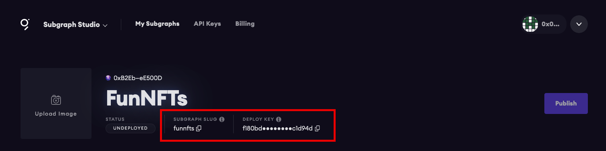

## Building NFT APIs with OpenZeppelin and The Graph

OpenZeppelin recently released [OpenZeppelin Subgraphs][https://docs.openzeppelin.com/subgraphs/0.1.x/], a set of modules and CLI tools that make it easy to index OpenZeppelin contracts activity and make it available via an open API using The Graph Protocol.

These tools abstract away a lot of the code that you'd typically need to write to create a Subgraph when using various modules that OpenZeppelin supports.

As of now, the project supports these modules:

- AccessControl
- ERC20
- ERC721
- ERC1155
- ERC1967Upgrade
- Governor
- Ownable
- Pausable
- Timelock

Using the project, you can get up and running with a subgraph in just a few minutes, either deploying it as is, or using it as a boilerplate and adding your own customizations.

### What we'll be building

In this guide, we'll look at how to leverage OpenZeppelin Subgraphs to build an NFT API that indexes and makes data queryable from a few NFT smart contracts - Cool Cats and Pudgy Penguins.

The API will allow us to query NFT data from these two projects, making both the NFT data as well as the data from the acounts that own the NFTs available.

Here are the smart contract addresses that we'll be working with:

- [Cool Cats](https://etherscan.io/address/0x1a92f7381b9f03921564a437210bb9396471050c)
- [Pudgy Penguins](https://etherscan.io/address/0xBd3531dA5CF5857e7CfAA92426877b022e612cf8)

### Dependencies

To be successful in this guide, you will need the following

- Node.js - Consider [nvm](https://github.com/nvm-sh/nvm) to install Node.js on your machine
- [Graph CLI](https://github.com/graphprotocol/graph-cli)
- Metamask or WalletConnect compatible wallet

### Getting started

To get started, we'll first need to initialize a new subgraph in the Subgraph Studio.

Go to [https://thegraph.com/studio/](https://thegraph.com/studio/) and click __Connect Wallet__ to connect your Ethereum wallet.

Next, click __Create a Subgraph__ to create a new subgraph.

Here, give the subgraph a name (like FunNFTs) and click __Continue__.

Now the subgraph has been initialized in the Subgraph Studio and we can continue to our local development environment.

### Building the subgraph

Next, we'll create a new folder and initialize a new `package.json` file:

```sh
npm init --y
```

Next, install the OpenZeppelin Subgraph package:

```sh
npm install @openzeppelin/subgraphs
```

Now all we need to do is define the smart contract addresses as well as the entity types that we'd like to index.

To do so, we can create a new file named __subgraphconfig.json__ and add the following lines of configuration:

```json
{
  "output": "generated/sample.",
  "chain": "mainnet",
  "datasources": [
    { "address": "0xBd3531dA5CF5857e7CfAA92426877b022e612cf8", "startBlock":  12878203, "module": [ "erc721", "ownable" ] },
    { "address": "0x1a92f7381b9f03921564a437210bb9396471050c", "startBlock":  12743024, "module": [ "erc721", "ownable" ] }
  ]
}
```

The array of data sources allows us to define the following properties for each item in the array:

- Smart contract address
- The start block (optional)
- Array of entities / modules that we'd like to index.

In the coonfiguration we've created, we've decided to index both the `erc721` token data as well as `ownable` for indexing the ownership information of the tokens.

That is all of the configuration we need! We can now build the subgraph.

To build the subgraph, run the following command:

```sh
npx graph-compiler \
  --config subgraphconfig.json \
  --include node_modules/@openzeppelin/subgraphs/src/datasources \
  --export-schema \
  --export-subgraph
```

After running this command, you should have the subgraph compiled in a new folder named __generated__. In this folder, you should see two files:

- __sample.schema.graphql__ - The GraphQL schema / data model
- __sample.subgraph.yaml__ - The main subgraph configuration

Update the naming of __sample.subgraph.yaml__ to __subgraph.yaml__.

Now we are ready to deploy.

### Deploying and testing the subgraph

To deploy to Subgraph Studio and begin testing out the API, we need to have the subgraoh __DEPLOY KEY__ as well as the __SUBGRAPH SLUG__, both of which are available in the Subgraph Studio dashboard for the individual subgraph.



First, change into the newly created __generated__ folder:

```sh
cd generated
```

Next, we'll use the Graph CLI to authenticate and authorize the deployment from your local environment:

```sh
graph auth --studio

> Paste in DEPLOY KEY when prompted
```

Now, we can deploy by running the following command:

```sh
graph deploy --studio <subgrpahslug>
```

Once the deployment is complete, you should be ready to start testing it out!

### Testing out the API

In the Subgraph Studio you can run queries using the built in GraphQL Playground.

The first query we'll run will be to just return the NFT token data:

```graphql
{
  erc721Tokens {
    id
    identifier
    uri
  }
}
```

We can also enhance this query by passing in arguments, for instance if we wanted to order by the token `identifier`:

```graphql
{
  erc721Tokens(
    orderBy: identifier,
    orderDirection: asc
  ) {
    id
    identifier
    uri
  }
}
```

We can query for transfer events, in the order in which they were transferred:

```graphql
{
  erc721Transfers(
    orderBy: timestamp
    orderDirection: desc
  ) {
    timestamp
    token {
      identifier
      uri
    }
  }
}
```

Finally, we may want to query for users and their tokens:

```graphql
{
  accounts {
    id
    ERC721tokens {
      identifier
      uri
    }
  }
}
```

### Next steps

The API is now ready to deploy. You can test it out in your front end application by following [this guide](https://thegraph.com/docs/developer/querying-from-your-app), using the __TEMPORARY QUERY URL__ given to you by the Subgraph Studio in the __Details__ view.

When you are ready to put your API into production, you can [publish your subgraph to the decentrlized network](https://thegraph.com/docs/studio/subgraph-studio#publish-your-subgraphs).

To learn how to build a subgraph from scratch, have a look at [this guide](https://thegraph.com/blog/building-with-subgraph-studio).